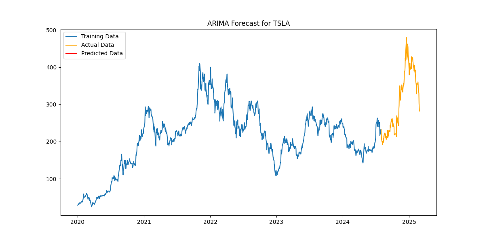

# Stock Price Forecasting and Volatility Modeling (ARIMA-GARCH)

## 📌 Project Overview
This project uses Python to apply **ARIMA** (AutoRegressive Integrated Moving Average) and **GARCH** (Generalized Autoregressive Conditional Heteroskedasticity) models to forecast stock prices and analyze market volatility. These models are widely used in financial time series forecasting to predict price movements and quantify risk.



## ARIMA Model Summary

- **Model:** ARIMA(5,1,0)
- **Observations:** 1152
- **AIC:** 2115.200
- **BIC:** 2145.491
- **Significant Lags:** L3 (p = 0.001), L5 (p = 0.014)

Full results available in [`results/arima_summary_TSLA.txt`](results/arima_summary_TSLA.txt).


## 📊 Data Description
- **Dataset**: Historical stock price data from Yahoo Finance (or other sources).
- **Key Variables**:
  - `Date`: The trading date.
  - `Close`: The closing price of the stock.
  - `Volume`: The number of shares traded.
  - `Returns`: Logarithmic returns calculated from closing prices.

## 🛠 Tools & Technologies
- **Python:** `pandas`, `numpy`, `statsmodels`, `arch`, `matplotlib`, `seaborn`
- **SQL:** Used for querying and preprocessing data.
- **Data Visualization:** `matplotlib`, `seaborn`, `plotly`
- **Web-based Dashboard (Optional):** HTML, CSS, JavaScript, D3.js/Chart.js for interactive visualizations.

## 📈 ARIMA & GARCH Implementation
1. **Data Preprocessing**
   - Load and clean the dataset.
   - Convert prices to log returns.
   - Check for stationarity using the ADF test.

2. **ARIMA Model for Forecasting**
   - Identify the best ARIMA parameters using ACF & PACF plots.
   - Fit the ARIMA model to predict future stock prices.

3. **GARCH Model for Volatility Analysis**
   - Fit a GARCH(1,1) model to model stock price volatility.
   - Compare different GARCH specifications.

4. **Model Evaluation**
   - Assess forecasting accuracy using RMSE and AIC/BIC.
   - Visualize forecast results and confidence intervals.

## 📉 Results & Insights
- Forecasted stock price trends for the next 30 days.
- Estimated volatility levels and their impact on risk assessment.
- Key takeaways from model performance and limitations.

<details>
  <summary>📊 ARIMA Forecast</summary>
  
</details>

## 🔧 Installation & Dependencies
To run this project, install the necessary Python libraries:
```bash
pip install pandas numpy matplotlib seaborn statsmodels arch plotly yfinance
```

## 🚀 How to Run
1. Clone the repository:
   ```bash
   git clone https://github.com/yourusername/stock-price-forecasting-and-volatility-modeling-arima-garch.git
   ```
2. Navigate to the project folder:
   ```bash
   cd stock-price-forecasting-and-volatility-modeling-arima-garch
   ```
3. Run the Python script:
   ```bash
   python main.py
   ```

## 📌 Future Improvements
- Implement LSTM models for deep learning-based forecasting.
- Integrate real-time stock price updates via an API.
- Develop a web-based interactive dashboard.

---
📢 **Author:** Foster Dompreh
🔗 **GitHub:** [Your Profile](https://github.com/kweku3)  
📬 **Contact:** kwekugt@gmail.com

## License
This project is licensed under the MIT License.